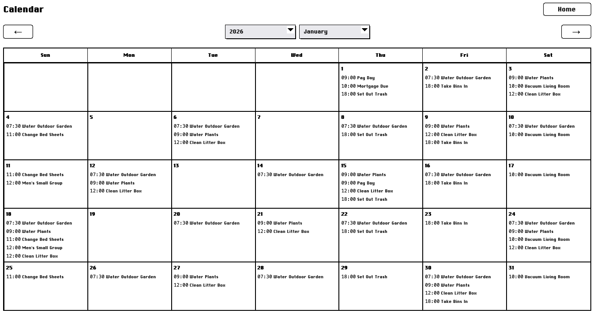
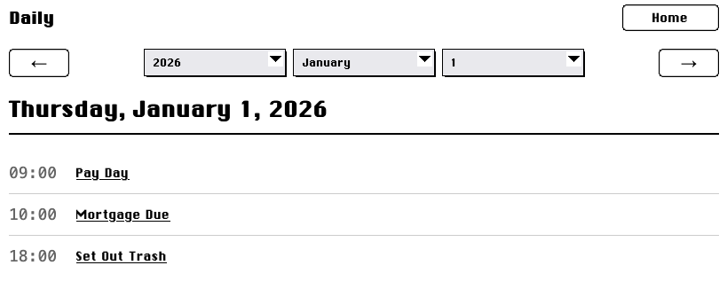
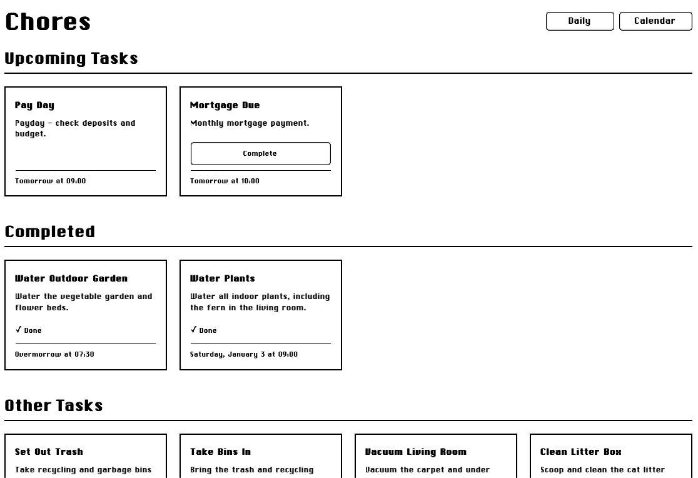

# Chores

A calendar system that combines recurring meetings with a todo list, thus creating a fresh todo list for each day.

*The monthly calendar*

*The Daily task list*

*The home page overview*

## Setup.

You'll need the Rust build system which you can get from [rustup](https://rustup.rs/).

1. Clone the repository.
2. `cargo run --bin chores`

There are also a couple of other bins to help with maintenence:

- `backup` creates a copy of the database file without locking it.
    - Usable while the server is running
    - `cargo run --bin backup --db <DB TO BACK UP> --target <BACKUP DESTINATION>`
    - If 'taget' flag is ommitted, defaults to `backup_{year}_{month}_{day}.db`, which is useful for chron jobs
- `clear` completely clears the database. It does not back up anything.
- `seed` seeds the database with a few example records. You probably don't need this except as a demo.

## Environment variables

Environment variables can be set in the bash environment, in the .env file, or as flag arguments.

| Variable | Flag | Env var name | Description | Example |
| --- | --- | --- | --- | --- |
| Touch Mode | t | TOUCH | If present/true, makes links into large buttons | N/A |
| Time Zone | tz | TZ | Locale string for the sever and user's time zone | America/Chicago |
| Database File | db | DATABASE_URL | The file path to place/use the sqlite file. | chores.db |

## Credits

### system.css

Copyright (c) 2022 Sakun Acharige

Permission is hereby granted, free of charge, to any person obtaining
a copy of this software and associated documentation files (the
"Software"), to deal in the Software without restriction, including
without limitation the rights to use, copy, modify, merge, publish,
distribute, sublicense, and/or sell copies of the Software, and to
permit persons to whom the Software is furnished to do so, subject to
the following conditions:

The above copyright notice and this permission notice shall be
included in all copies or substantial portions of the Software.

THE SOFTWARE IS PROVIDED "AS IS", WITHOUT WARRANTY OF ANY KIND,
EXPRESS OR IMPLIED, INCLUDING BUT NOT LIMITED TO THE WARRANTIES OF
MERCHANTABILITY, FITNESS FOR A PARTICULAR PURPOSE AND
NONINFRINGEMENT. IN NO EVENT SHALL THE AUTHORS OR COPYRIGHT HOLDERS BE
LIABLE FOR ANY CLAIM, DAMAGES OR OTHER LIABILITY, WHETHER IN AN ACTION
OF CONTRACT, TORT OR OTHERWISE, ARISING FROM, OUT OF OR IN CONNECTION
WITH THE SOFTWARE OR THE USE OR OTHER DEALINGS IN THE SOFTWARE.